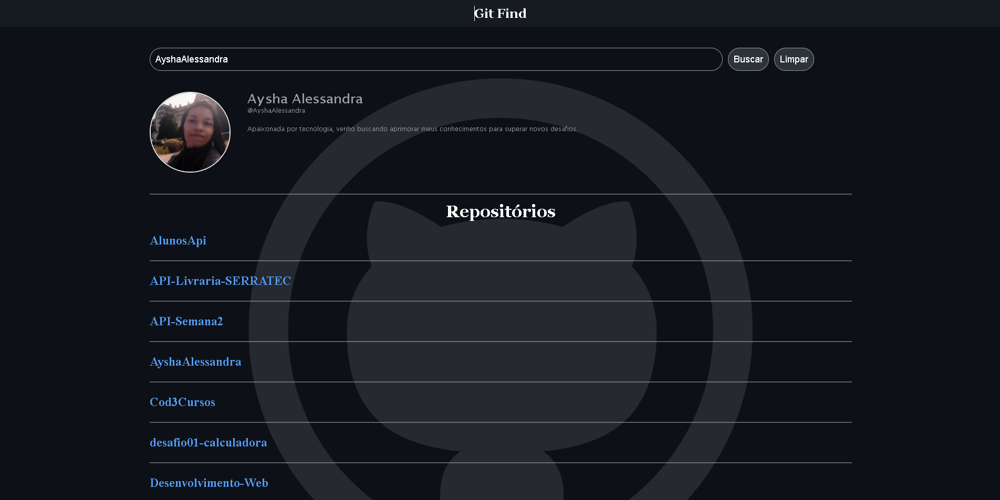

<!-- ###### Em desenvolvimento ⚠️ -->

<div>
    
</div>

## 📘 Sobre GitFind 

Este projeto foi criado com o objetivo de consumir a API do GitHub e através dela, buscar e mostrar algumas informações de usuário, como: foto, bio e os repositórios publicados.

<br/>

> Instruções iniciais.

<p>
    Já feito o clone do projeto, abra o terminal e rode o seguinte comando:
</p>

```
npm install
```

<p>
    Depois da instalação concluída, para rodar o projeto, segue o comando: 
</p>

```
npm run start
```

 ## 💻 Tecnologias utilizadas

* HTML
* CSS
* JavaScript
* ReactJs
